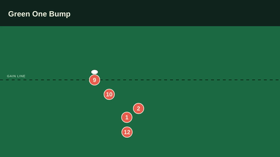
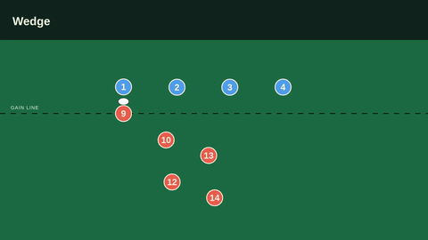

# Rugby Motion

Rugby play visualizations built with Motion Canvas. Plays are JSON files in `plays/` and are rendered as landscape animations on a full green diagram surface with numbered player tokens, a ball, title text, and a gain line.

## Example Output

**Green One Bump** ([plays/pods/green-one-bump.json](plays/pods/green-one-bump.json)):



**Wedge** ([plays/backs/wedge.json](plays/backs/wedge.json)):



GitHub does not reliably play inline `<video>` embeds sourced from repo files, so these are animated GIFs; the original MP4s are next to them in `docs/media/` for full quality. Regenerate both with:

```bash
npm run export -- --play=pods/green-one-bump
npm run export -- --play=backs/wedge
```

then copy the results from `out/` into `docs/media/` and re-encode as GIFs, e.g.:

```bash
ffmpeg -y -i docs/media/green-one-bump.mp4 -vf "fps=12,scale=480:-1:flags=lanczos,split[s0][s1];[s0]palettegen[p];[s1][p]paletteuse" docs/media/green-one-bump.gif
```

## Setup

Install dependencies:

```bash
npm install
```

The devcontainer installs `ffmpeg` and Chromium automatically when it is created.

## Preview

Start the Motion Canvas editor:

```bash
npm run serve -- --host 0.0.0.0 --port 9000
```

Open the forwarded port:

```text
http://localhost:9000/
```

Select a play by filename in the URL:

```text
http://localhost:9000/?play=pods/black-two-tips
http://localhost:9000/?play=pods/green-exit
http://localhost:9000/?play=pods/green-one-bump
http://localhost:9000/?play=backs/hands
http://localhost:9000/?play=backs/wedge
```

The `play` value is the JSON path under `plays/` without `.json`. New JSON files in `plays/` are discovered by Vite; restart the dev server if a newly added file does not appear.

Auto viewports include all player keyframes in the play. If the play would not fit at the configured maximum zoom, the renderer zooms out for that play so every player token remains visible. The rendered green area is the diagram surface rather than an exact touchline-bounded pitch.

## Authoring Plays

Create or edit a JSON file in `plays/`. The play's library identity comes from its relative file path, so `plays/pods/black-two-tips.json` is identified as `pods/black-two-tips`; play files do not need (and should not include) a top-level `id` field. Player IDs are scoped to that play, so separate play files may reuse IDs such as `p1`, `p2`, and `p9`.

Player positions can be absolute:

```json
{"t": 0, "x": 35, "y": 50}
```

Or relative to another player at the same timestamp:

```json
{
  "t": 0,
  "relative_to": "p9",
  "offset_m": {"behind": 3, "right": 5}
}
```

After a player's initial position is set, later keyframes can move from that player's own previous resolved position:

```json
{
  "t": 5,
  "from_previous": true,
  "offset_m": {"right": 8, "forward": 10}
}
```

For `attacking_direction: "toward_top"`, `forward` moves visually up the screen.

The supported play format is described in [SPEC.md](SPEC.md) and implemented by the types and loader in `src/play/`.

### Current Limitations

The schema accepts some fields the renderer does not yet display:

- `subtitle` is accepted but never shown.
- Of `field.show_markings`, only `gain_line` is actually drawn; other marking names are reserved for later.
- `annotations` and `title_card` are accepted but never shown.
- `attacking_direction` values other than the default have no distinct rendering behavior yet.
- `kick` ball events and pass `curve` values other than `straight` are not implemented.

## Checks

Run the motion regression tests:

```bash
npm test
```

Run the TypeScript and production bundle check:

```bash
npm run build
```

## Export

Export every JSON play to a play-specific MP4:

```bash
npm run export
```

The batch exporter discovers every `plays/**/*.json` file and writes one matching MP4 per play in `out/`, preserving folder structure:

```text
plays/pods/black-two-tips.json -> out/pods/black-two-tips.mp4
plays/pods/green-exit.json     -> out/pods/green-exit.mp4
plays/backs/hands.json         -> out/backs/hands.mp4
```

To export one play:

```bash
npm run export -- --play=pods/black-two-tips
```

To check discovery without rendering video:

```bash
npm run export -- --dry-run
```

The exporter uses Motion Canvas's FFmpeg exporter, waits for `output/project.mp4`, validates that the MP4 is readable, and moves it to the play-specific file in `out/`.

## Project Settings

Shared visualization settings are in [src/projectConfig.ts](src/projectConfig.ts), including the canvas, maximum pitch scale, title typography, and title-safe area.

The project is configured for a 1920x1080 landscape output in `src/project.meta`.
